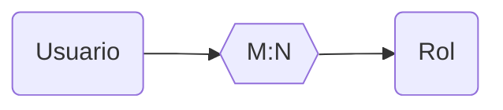
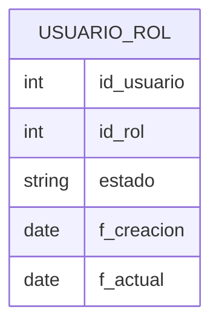
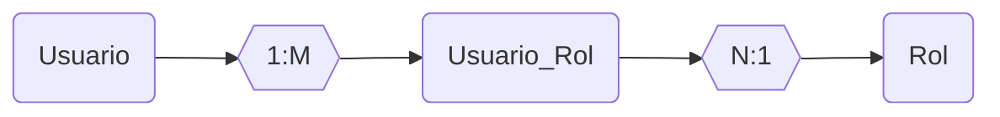
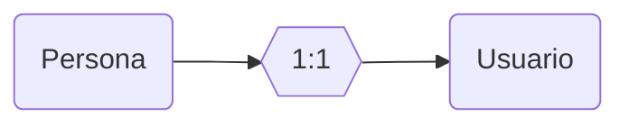

## Tarea 08-06
Realizar las clases derivadas de vehiculo
* Automovil
* Buseta
* Moto

### Posibles reglas de negocio
Aplicar descuento a autos eléctricos e híbridos. 
---
## Tarea 10-06
Implementar Update DTO y levantar
* [X] Servicio Levantado.
* [X] Creación Validada
* [ ] Dto de actualización creado
* [ ] Probar la actualización y validaciones

# Clase 15-06
Gestión de usuarios y roles.
Varios usuarios a varios roles

Se separa la relación de varios a varios con tabla intermedia

Se agrega una tabla persona a la relación

Permite separar info de la persona, de la infor de su usuarios
* Registra primero la persona.
* Con su información, se genera el nombre del usuario.
* Autoincrementar nombres de usuario iguales. Ej: Marcelo Alejandro Pareja - mapareja, Marco Araujo Pareja - mapareja1
* Al crear una persona, deben crearse los usuarios.
* Endpointa para:
    * Crear roles
    * Asignar Roles
* Cumplir principios SOLID con patrones de diseño
* Frameworks (Recomendado Springboot, NestJs)
* Id de usuario que no sea numérico secuencial, si no UUID.
