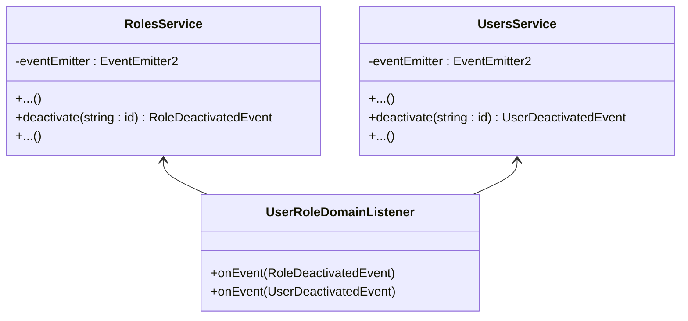

## Patrón de Diseño usado - Observer
Es un patrón de comportamiento que está formado por 2 clases, uno o varios observers que monitorean y notifican de cambios en el sistema, y uno o varios listeners que escuchan a los observers y reaccionan a los cambios. En este caso, se usaron eventos para **comunicar los cambios al desactivar un rol o usuario**, para que se desactiven todas las asignaciones de la tabla usuario-rol. La estructura es la siguiente:

